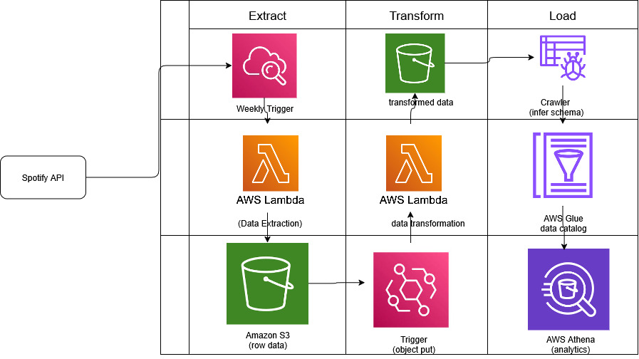

# Client Requirements
Client is in music industry business.He wants to understand what types of song work by analysing the top global songs in the billboard. He wants to find some pattern in the type of songs which make it to the global songs billboard.He also wants to know which artists are trending,which albums are trending.He wants to collect this data on a weekly basis, and find some insights based on this data collected.

# Problem Description
Client wants to understand the music industry business. Basically he wants answer to the following questions
1. What types of songs are trending on a weekly basis??
2. What are the different artists trending on a weekly basis??
3. What albums are trending weekly on a global billboard, and who are the artists of these albums??

Based on the problem, we have to tackle the following
1. Build a ETL pipeline, that takes data from spotify API on a weekly basis, and generates reports answering the above questions.

# Architecture of ETL pipeline.

# ETL Steps

1. Create a Spotify API account and get the client and secret key
2. Extract data from Spotify API and deploy in AWS Lambda, applying clodwatch service to run the code on a weekly basis
3. Collect the raw data in a AWS s3 bucket
4. Apply put trigger in the raw S3 bucket, so that whenever data is put into s3 bucket, run transformation login using AWS lambda service
5. Store the transformed data in a Aws s3 bucket
6. Use crawler to infer schema on the s3 bucket of the transformed logic
7. Build the glue catalog to store the data metadata.
8. Use amazon athena for showing the transformed logic, use SQL for answering the business questions.

